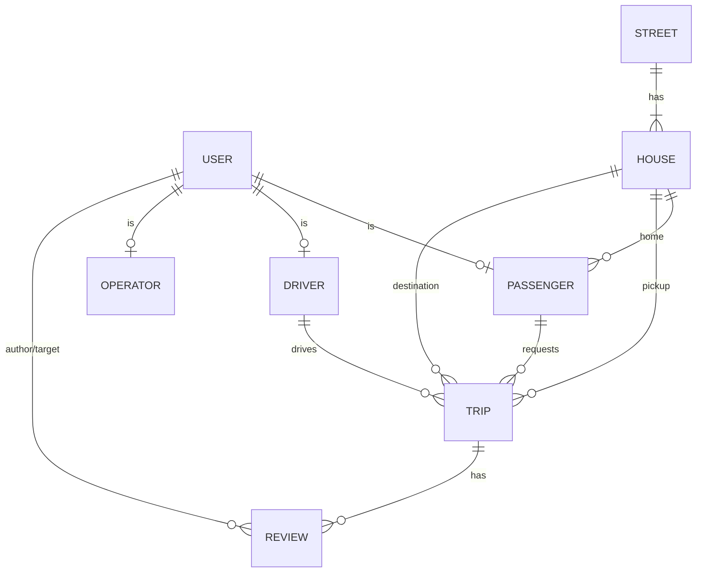

```mermaid
erDiagram
    USER ||--o| PASSENGER : "is"
    USER ||--o| DRIVER : "is"
    USER ||--o| OPERATOR : "is"

    STREET ||--|{ HOUSE : "has"
    HOUSE ||--o{ PASSENGER : "home"

    PASSENGER ||--o{ TRIP : "requests"
    DRIVER ||--o{ TRIP : "drives"
    HOUSE ||--o{ TRIP : "pickup"
    HOUSE ||--o{ TRIP : "destination"

    TRIP ||--o{ REVIEW : "has"
    USER ||--o{ REVIEW : "author/target"
```
